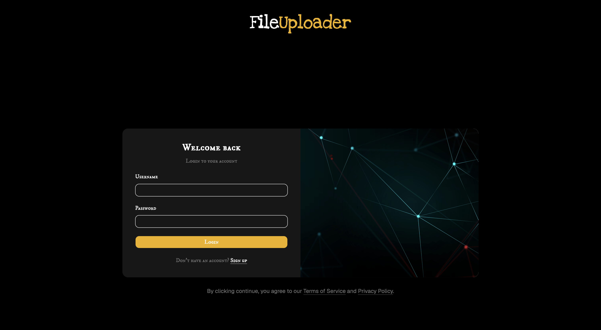
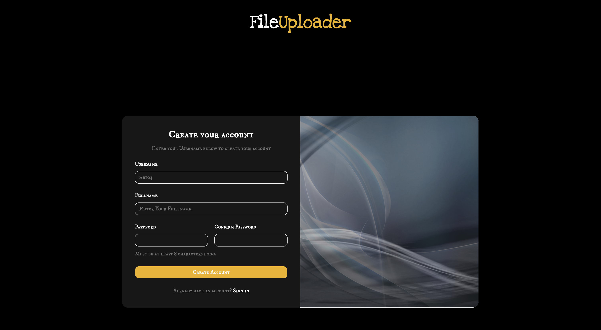
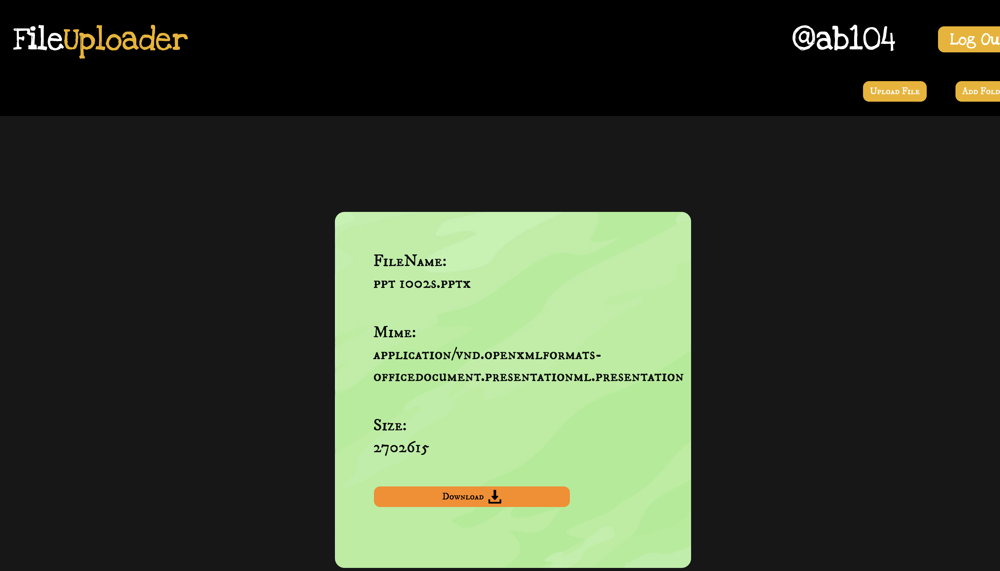
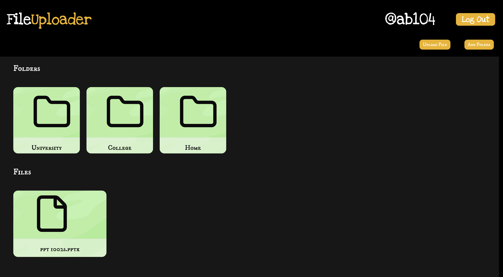

# File Uploader

A full-stack file management application built with React, TypeScript, Node.js, Express, Prisma, and PostgreSQL. Users can create folders, upload files, organize files inside folders, view file information, and download files.

## Features

* User signup and login
* Session-based authentication with Passport.js
* Create folders
* Upload files with Multer
* Upload files with or without a folder
* View all folders and files
* View files inside a specific folder
* View individual file information
* Download files
* File metadata stored in PostgreSQL
* Responsive dashboard interface
* Toast notifications for successful and failed operations

## Tech Stack

### Frontend

* React
* TypeScript
* Vite
* Tailwind CSS
* shadcn/ui
* React Router
* Sonner
* Lucide React

### Backend

* Node.js
* Express.js
* Passport.js
* Multer
* Prisma ORM
* express-session
* connect-pg-simple
* bcrypt
* Express Validator

### Database

* PostgreSQL
* Neon PostgreSQL
* Prisma ORM

### Deployment

* Vercel - Frontend
* Render - Backend
* Neon - PostgreSQL Database

## Project Structure

```text
file-uploader/
├── client/
│   ├── src/
│   │   ├── components/
│   │   ├── pages/
│   │   └── ...
│   ├── package.json
│   └── vite.config.ts
│
├── server/
│   ├── controller/
│   ├── middleware/
│   ├── query/
│   ├── router/
│   ├── prisma/
│   │   ├── schema.prisma
│   │   └── migrations/
│   ├── uploads/
│   ├── app.js
│   └── package.json
│
└── README.md
```
The demonstration of the project can be found on [(https://file-uploader-gilt.vercel.app/)](https://file-uploader-gilt.vercel.app/)

The screenshots of the project are









